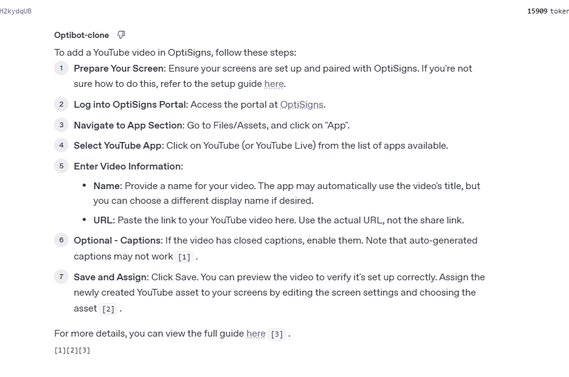

## Live Logs Access

🔗 **View live logs**: [http://143.198.228.47:8080/logs/scraper.log](http://143.198.228.47:8080/logs/scraper.log)

## Screenshots

### Bot screenshot



## Setup

### Prerequisites

- Docker and Docker Compose installed
- OpenAI API key (for vector store functionality)

### Environment Variables

Create a `.env` file in the project root:

```env
OPENAI_API_KEY=your_openai_api_key_here
VECTOR_STORE=your_vector_store_name_here
```

### Installation

1. Clone the repository
2. Configure environment variables in `.env` file
3. Build and run with Docker Compose:

```bash
docker-compose up -d
```

The bot will start automatically and begin its daily scraping schedule.

## How to Run Locally

```bash
# Build and start the container
docker-compose up -d

# View logs
docker-compose logs -f scrape-bot

# Stop the container
docker-compose down
```

### Real-time Log Monitoring

**Web Interface (Recommended)**:
- Live logs: [http://143.198.228.47:8080/logs/scraper.log](http://143.198.228.47:8080/logs/scraper.log)
- Log server home: [http://143.198.228.47:8080/](http://143.198.228.47:8080/)

**Command Line**:
```bash
# View live logs
docker-compose logs -f scrape-bot

# View logs from host system
tail -f logs/scraper.log
```

### Log Files Location
- **Web Interface**: [http://143.198.228.47:8080/logs/scraper.log](http://143.198.228.47:8080/logs/scraper.log)
- **Container logs**: `/var/log/scraper.log`
- **Host logs**: `./logs/scraper.log`

### Log File Contents
The logs include:
- Scraping session timestamps
- Number of articles found and processed
- Vector store upload status
- Error messages and debugging information
- Health check results

## Project Structure

```
scrape-bot/
├── main.py              # Main scraper application
├── log_file_server.py   # Web server for log file access
├── requirements.txt     # Python dependencies
├── Dockerfile          # Container configuration
├── docker-compose.yml  # Service orchestration
├── crontab             # Cron schedule configuration
├── articles/           # Scraped articles (markdown files)
├── logs/              # Application logs
├── screenshots/       # Documentation screenshots
└── README.md          # This file
```

## Scraped Data

- **Format**: Markdown files with metadata headers
- **Location**: `./articles/` directory
- **Naming**: Articles are saved using their unique article IDs
- **Content**: Includes title, metadata, and converted HTML content
- **Chunk Strategy**: Since I do not understand much about chunking for embedding I chose default strategy

### Sample Article Format

```markdown
# Article Title

**Article ID:** 123456789
**Section ID:** 987654321
**Article URL:** https://support.optisigns.com/...
**Created At:** 2024-01-01T00:00:00Z
**Updated At:** 2024-01-02T00:00:00Z

---

Article content in markdown format...
```

## Configuration

### Cron Schedule
Modify `crontab` file to change the scraping schedule:
```bash
# Current: Daily at 2:00 AM UTC
0 2 * * * cd /app && python main.py >> /var/log/scraper.log 2>&1

# Alternative: Every 6 hours
0 */6 * * * cd /app && python main.py >> /var/log/scraper.log 2>&1
```

### Resource Limits
Docker resource limits are configured in `docker-compose.yml`:
- Memory: 512MB limit, 256MB reserved
- CPU: 0.5 cores limit, 0.25 cores reserved

## Health Monitoring

The container includes health checks that verify the cron service is running:
- **Interval**: 30 seconds
- **Timeout**: 10 seconds
- **Retries**: 3 attempts
- **Start period**: 10 seconds

Check container health:
```bash
docker-compose ps
```

## Vector Store Integration

The scraper can automatically upload articles to OpenAI's vector store for enhanced search capabilities:

- Tracks upload status for each article
- Supports batch processing
- Includes metadata for vector store attachments
- Provides detailed status reporting

## Troubleshooting

### Common Issues

1. **Container won't start**
   - Check Docker daemon is running
   - Verify environment variables are set
   - Check logs: `docker-compose logs scrape-bot`

2. **No articles being scraped**
   - Verify internet connectivity
   - Check API endpoints are accessible
   - Review scraper logs for error messages

3. **Vector store upload failures**
   - Verify OpenAI API key is valid
   - Check vector store ID exists
   - Monitor API rate limits

### Debug Mode

Run with verbose logging:
```bash
docker-compose exec scrape-bot python main.py --verbose
```

## License

This project is for educational and research purposes. Please respect the terms of service of the websites being scraped.
